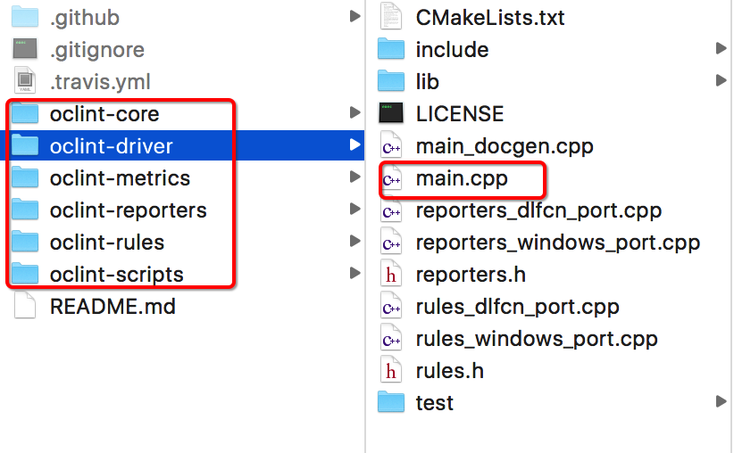
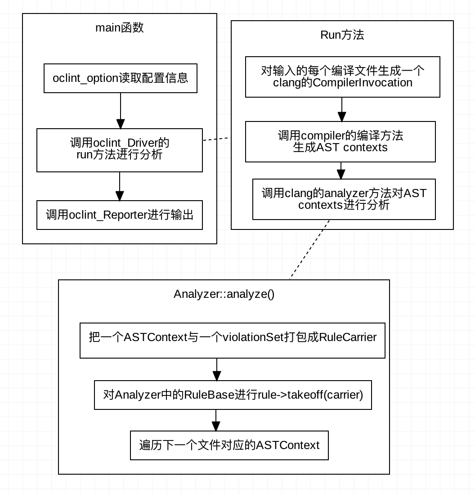

## OClint学习笔记

[TOC]

官方文档地址 ： http://docs.oclint.org/en/stable/
<!-- more -->
### 一、简介

`OCLint`是一个静态代码分析工具，通过分析`C、C++、Objective-C`代码寻找潜在的问题，找出可能出现的潜在错误，减少复杂代码、冗余代码，提高代码质量。具有下面特点：

* `OCLint`依赖于源代码的抽象语法数，检查高效并准确
* 可以动态添加规则
* 通过配置命令行调用，有利于用户持续集成应用时对代码进行检查，维护成本很低

### 二、小试牛刀

OCLint提供Release版本的下载，Release版本使用方便但失去了自定义的功能。我们可以在https://github.com/oclint/oclint/releases 中找到所有历史的Release版本(包括源码)。

* 首先我们使用源码构建

  ```
  1. cd oclint-scripts
  2. ./make
  3. cd ..
  ```

  检查是否构建成功

  ```
  ./build/oclint-<major>.<minor>.dev.<git-hash>/bin/oclint
  ```

* 使用oclint 、oclint-json-compilation-database和oclint-xcodebuild可以生成分析报告

  *   使用oclint是最基础的用法

      ```
      用法：oclint [subcommand] [options] <source0> [... <sourceN>]

      选项：

      一般选项：

      -help  - 显示可用选项（帮助隐藏更多）
      -help-list  - 显示可用选项的列表（-help-list-hidden为更多）
      -version  - 显示此程序的版本

      OCLint选项：

      -R = <directory>  - 将目录添加到规则加载路径
      -allow-duplicated-violations  - 在OCLint报告中允许重复的违例
      -disable-rule = <rule name>  - 禁用规则
      -enable-clang-static-analyzer  - 启用Clang静态分析器，并将结果集成到OCLint报告中
      -enable-global-analysis  - 编译每个源，并跨全局上下文进行分析（取决于源文件的数量，可能导致高内存负载）
      -extra-arg = <string>  - 附加到编译器命令行的附加参数
      -extra-arg-before = <string>  - 添加到编译器命令行的附加参数
      -list-enabled-rules  - 列出已启用的规则
      -max-priority-1 = <threshold>  - 允许的最大优先级1违例数
      -max-priority-2 = <threshold>  - 允许的最大优先级2违例数
      -max-priority-3 = <threshold>  - 允许的最大优先级3违例数
      -no-analytics  - 禁用匿名分析
      -o = <path>  - 将输出写入<path>
      -p = <string>  - 构建路径
      -rc = <parameter> = <value>  - 覆盖规则的默认行为
      -report-type = <name>  - 更改输出报告类型 如html
      -rule = <rule name>  - 显式选择规则

      -p <build-path>用于读取编译命令数据库。
      ```

  * oclint-json-compilation-database提供了一个简便的方式使用`oclint`。从`oclint`命令看到我们要给每个源文件设置参数，这对含有大量文件的工程来说使用`oclint`命令是否麻烦。幸运的是`clang`在编译的时候会生成`JSONCompilationDatabase.json`文件 http://clang.llvm.org/docs/JSONCompilationDatabase.html ，这个文件中含有各个文件的编译参数。

           ​```
           使用方法: oclint-json-compilation-database [-h] [-v] [-debug] [-i INCLUDES]
                                                   [-e EXCLUDES]
                                                   [oclint_args [oclint_args ...]]
           
           OCLint for JSON Compilation Database (compile_commands.json)
           
           positional arguments:
             oclint_args           arguments that are passed to OCLint invocation
           
           optional arguments:
             -h, --help            show this help message and exit
             -v                    show invocation command with arguments
             -debug, --debug       invoke OCLint in debug mode
             -i INCLUDES, -include INCLUDES, --include INCLUDES extract files matching pattern 这些文件是JSONCompilationDatabase.json记录的
             -e EXCLUDES, -exclude EXCLUDES, --exclude EXCLUDES
                                   remove files matching pattern
           ​```

       ​    

  * `oclint-xcodebuild`对于使用`Xcode`的程序员来说带来极大的方便，它从`Xcode`编译日志中提取编译参数生成`compile_commands.json`。（另外`xcpretty`可以直接生成`JSONCompilationDatabase.json`）

  * 可以使用配置文件统一oclint的参数,有利于CI的配置修改。配置文件的文件名`.oclint`,如下面这个例子

      ```yaml
              rule-configurations:
      - key: CYCLOMATIC_COMPLEXITY
        value: 15
      - key: NPATH_COMPLEXITY
        value: 30
      - key: LONG_LINE
        value: 150
      output: oclint.html
      report-type: html
      max-priority-1: 2000
      max-priority-2: 4000
      max-priority-3: 6000
      enable-clang-static-analyzer: false
      ```


### 三、渐入佳境

* 学会使用规则

  *   设定规则的阈值,`oclint`的规则是用`dylib`的形式存在的，开发人员可以自定义自己的规则并把其编译成`dylib`。默认在安装时`oclint`给我们提供了大量的规则，这些默认规则的`dylib`放在安装目录下`lib/oclint/rules`。有些规则可以设置阈值，只有当代码中超出设置的阈值时才认为违反了这个规则。如`CyclomaticComplexityRule`（用来评价函数的圈负责度），可以使用`rc`参数

      ```shell
      -rc <threshold_name>=<new_value>
      -rc CYCLOMATIC_COMPLEXITY = 15 -rc LONG_LINE = 50
      ```

      下面列出所有可以配置阈值的默认规则

      | 名称                      | 描述                           | 默认阈值 |
      | ----------------------- | ---------------------------- | ---- |
      | CYCLOMATIC_COMPLEXITY   | 方法的循环复杂性（圈负责度）               | 10   |
      | LONG_CLASS              | C类或Objective-C接口，类别，协议和实现的行数 | 1000 |
      | LONG_LINE               | 一行代码的字符数                     | 100  |
      | LONG_METHOD             | 方法或函数的行数                     | 50   |
      | LONG_VARIABLE_NAME      | 变量名称的字符数                     | 20   |
      | MAXIMUM_IF_LENGTH       | `if`希块的行数                    | 15   |
      | MINIMUM_CASES_IN_SWITCH | switch语句中的case数              | 3    |
      | NPATH_COMPLEXITY        | 方法的NPath复杂性                  | 200  |
      | NCSS_METHOD             | 一个没有注释的方法语句数                 | 30   |
      | NESTED_BLOCK_DEPTH      | 块或复合语句的深度                    | 5    |
      | SHORT_VARIABLE_NAME     | 变量名称的字符数                     | 3    |
      | TOO_MANY_FIELDS         | 类的字段数                        | 20   |
      | TOO_MANY_METHODS        | 类的方法数                        | 30   |
      | TOO_MANY_PARAMETERS     | 方法的参数数                       | 10   |

  * 可以使用`-rule <rule name>`选择规则，`-disable-rule <rule name>`屏蔽规则。也可以在配置文件`.oclint`中配置：

           ​```
           rule-paths:
      - /path/to/rules
        rules:
        disable-rules:
      - GotoStatement
        ```
      
        ```

* 学会设置正确的OCLint检查结果输出格式

  OCLint可以输出各种格式的结果文件，包括`html、JSON、PMD、Text、Xcode、XML`，你甚至可以自定义输出格式只要重写libReporter生成一个动态连接口dylib即可。

  可以通过参数`-report-type <report name>`。也可以在配置文件`.oclint`中配置：

  ```yaml
  output: oclint.html
  report-type: html
  ```

* OCLint中内置的检查规则

  可以在（http://docs.oclint.org/en/stable/rules/index.html）中查看所有内置规则，以及他们的详细描述

* 学会屏蔽某些警告

  我们已经知道可以通过设置阈值来屏蔽某些过于严格的校验，但即便如此我们还是会想去掉更多的警告，值留下那些我们真正关心的警告。

  - 直接修改那些规则的源码，重新生成dylib规则

  - 直接删去这条规则，过在配置中屏蔽它

  - 使用注释（用例屏蔽代码中个别地方），粒度最细的一种屏蔽警告，但其对源代码有所侵入,如下：

    ```shell
    __attribute__ （（annotate （“oclint：suppress [unused method parameter]” ））））
    ```

    注释影响的范围同其位置相关，如注释添加到方法声明，则抑制会影响方法，其整个内容包括其所有参数，语句，表达式，局部变量等。如下例：

    ```objective-c
    bool __attribute__((annotate("oclint:suppress"))) aMethod(int aParameter)
    {
        // warnings within this method are suppressed at all
        // like unused aParameter variable and empty if statement
        if (1) {}

        return true;
    }

    - (IBAction)turnoverValueChanged:
        (id) __attribute__((annotate("oclint:suppress[unused method parameter]"))) sender
        // suppress sender variable
    {
        int i; // won't suppress this one
        [self calculateTurnover];
    }

    - (void)dismissAllViews:(id)currentView parentView:(id)parentView
       __attribute__((annotate("oclint:suppress")))
       // again, suppress the warnings for entire method
    {
        [self dismissTurnoverView];
        // plus 30+ lines of code of dismissing other views
    }
    ```

    可以使用`//！OCLINT `对行进行注释, 基于注释的抑制不关心违反类型或违反的数量，它只是忽略该特定行上的每个警告

    ```objective-c
    void a() {
        int unusedLocalVariable; //!OCLINT
    }
    ```

### 四、知其所有然

—、 理解AST

`OCLint`依赖于源代码的抽象语法树（AST），AST是分析的核心。开源的`Clang`是`oclint`获得AST的依赖工具。（关于如何从clang获得AST这里有一个很好的视频https://www.youtube.com/watch?v=VqCkCDFLSsc&feature=youtu.be），相关讲解https://jonasdevlieghere.com/understanding-the-clang-ast/

*理解Clang AST*

```c++
clang -Xclang -ast-dump -fsyntax-only test.cpp   //  可以在命令行执行它，直观的看一下一段测试代码的AST结构
```

 `ASTContext`保存着一些未在AST节点当中的上下文信息，AST的构建主要是三个工具类[declarations](http://clang.llvm.org/doxygen/classclang_1_1Decl.html)、[statements](http://clang.llvm.org/doxygen/classclang_1_1Stmt.html) 、[types](http://clang.llvm.org/doxygen/classclang_1_1Type.html)。这三个类构建出语法树上的各个节点，但是他们之间没有相同的接口用于遍历，每个类型有自己的遍历方法。每个节点有自己的 [SourceLocation](http://clang.llvm.org/doxygen/classclang_1_1SourceLocation.html) class（其实就是源代码中的位置）。相关链接：http://clang.llvm.org/docs/IntroductionToTheClangAST.html

想对源代码进行分析，遍历查找AST中节点十分重要。Clang提供了两种遍历查找AST的方式，[RecursiveASTVisitor](http://clang.llvm.org/docs/RAVfront%20endAction.html) 和[ASTMatchers](http://clang.llvm.org/docs/LibASTMatchers.html)。

*  所谓recursiveASTVisitor其实就是Clang的一个AST的FrontendAction的概念，由于Clang的语法树的节点元素没有一个公共的继类，所以树的遍历算法与经典树算法不同，AST节点有很多种，每种节点又有数目众多的访问方法，所以AST上遍历是一件很麻烦的事情，但它这么设计其实不是让我们遍历数，而是方便我们做一些事情。比如找到一个类型的定义，这样我们只要关心与定于相关的节点部分即可。使用RecursiveASTVisitor我们只要给出我们要找的节点是什么调用相关类型，遍历部分有ASTFrontendAction和ASTConsumer完成。

* ASTMatchers是定义了一种称为 domain specific language（领域明确语言？DSL）的模式语言，用于匹配在AST中的一段代码节点。

   > This DSL is written in and can be used from C++, allowing users to write a single program to both match AST nodes and access the node’s C++ interface to extract attributes, source locations, or any other information provided on the AST level.

   DSL模式语言是一些固定函数的组合，匹配语言阅读起来很明确，但记忆和学习DSL的匹配器真是酸爽 (>д<)。系统定义的匹配器罗列见http://clang.llvm.org/docs/LibASTMatchersReference.html#recordDecl0Anchor，也可以自定义匹配器见http://clang.llvm.org/docs/LibASTMatchers.html#astmatchers-writing。

   举个栗子：

   recordDecl()可以匹配所有类的声明，要找到名为“Foo”的声明可以使用recordDecl(hasName("Foo"))，如果在加上从“Bar”继承的，可以写作recordDecl(hasName("Foo"), isDerivedFrom("Bar"))。

   如何利用这些匹配器写出我们想要的查找模式，官方给出一个指导：

   * 在Clang的AST中找到要匹配的最外面的类。
   * 查看[AST匹配器文档](http://clang.llvm.org/docs/LibASTMatchersReference.html)，查找匹配您感兴趣的节点或缩小节点[属性](http://clang.llvm.org/docs/LibASTMatchersReference.html)的匹配器。
   * 创建外部匹配表达式。验证它按预期工作。
   * 检查匹配器你想要匹配的下一个内部节点是什么。
   * 重复，直到匹配器完成。

二、OCLint代码源码结构

OCLint的源码结构比较清晰（￣ω￣ ）。driver目录下是整程序的驱动部分，从main函数开始可以看到整个过程。

| 目录结构                           | 调用关系                                     |
| ------------------------------ | ---------------------------------------- |
|    |  |
|  |                                          |

从上图可以看到analyzer会调用rule的takeoff方法，所有rule的基类都是 RuleBase。 RuleBase含有一个 RuleCarrier的成员，它包含了每个文件对应的 ASTContext和一个violationSet用来存储违反规则的检查输出信息。每个Rule所做的事情其实就是检查其成员`RuleCarrier.ASTContext`,如果发现有违反规则的地方就把结构输到`RuleCarrier.violationSet`中。从RuleBase继承实现自己的规则是最灵活的，但是也最复杂的。可以从三个派生类继承`AbstractSourceCodeReaderRule`, `AbstractASTMatcherRule`,`AbstractASTVisitorRule`。  `AbstractSourceCodeReaderRule`是对代码中每一个行进行扫描，子类处理eachline即可。后面两个分别对应Clang提供了两种遍历AST的方式，对照源代码和[RecursiveASTVisitor](http://clang.llvm.org/docs/RAVFrontendAction.html) 和[ASTMatchers](http://clang.llvm.org/docs/LibASTMatchers.html)即可理解OCLint的核心处理逻辑。

### 五、高级功能-自定义规则

有前一个小节我们知道OCLint结合Clang的[RecursiveASTVisitor](http://clang.llvm.org/docs/RAVFrontendAction.html) 和[ASTMatchers](http://clang.llvm.org/docs/LibASTMatchers.html)提供了两个rule的抽象类`AbstractASTMatcherRule`,`AbstractASTVisitorRule`便于我们写自己的规则。

* 继承AbstractASTVisitorRule

  大多数规则都是这种实现方式，我们只要重写我们关系的语法片段即可，比如我们想要检查所有if语句的语法规则就可以复写VisitIfStmt方法

  ```c++
  bool VisitIfStmt(IfStmt *ifStmt)
  {
      // do stuff with this if statement
      return true;
  }
  ```

  再比如我们想要分析一个Objective-C 方法

  ```c++
  bool VisitObjCMethodDecl(ObjCMethodDecl *decl)
  {
      // analyze decl
      return false;
  }
  ```

  具体有哪些可以参照https://clang.llvm.org/doxygen/classclang_1_1ASTDeclReader.html，https://clang.llvm.org/doxygen/classclang_1_1ASTNodeImporter.html

* 继承AbstractASTMatcherRule

  使用match写规则更加简洁清晰，继承AbstractASTMatcherRule重写setUpMatcher方法，在其中添加查找模式，并绑定一个唯一的ID。

  每当匹配到一个会调用callback，我们需要重写callback对查找结果进行处理。可以查看OCLint的BitwiseOperatorInConditionalRule规则源码学习AbstractASTMatcherRule。

* 使用scaffoldRule快速创建规则

  scaffoldRule是一个Python命令行工具，它使用模板(在./oclint-rules/template/目录下)的方式生成对应类型的规则文件（.h  .cpp）。脚本的具体参数有：

  ```shell
  用法: scaffoldRule [-h] [-t {Generic,SourceCodeReader,ASTVisitor,ASTMatcher}]
                      [-c RULE_CATEGORY] [-n RULE_NAME] [-p {1,2,3}] [--test]
                      [--no-test]
                      class_name

  位置参数:
    class_name            规则的名字

  可选参数:
    -h, --help            显示命令的帮助信息并退出命令
    -t {Generic,SourceCodeReader,ASTVisitor,ASTMatcher}, --type {Generic,SourceCodeReader,ASTVisitor,ASTMatcher}   规则类型
    -c RULE_CATEGORY, --category RULE_CATEGORY
    -n RULE_NAME, --name RULE_NAME
    -p {1,2,3}, --priority {1,2,3}
    --test                Generate a test for the new rule (default)
    --no-test             Do not generate a test for the new rule
  ```

  ​

* 编译规则

  使用OCLint提供的`build_dynamic_rule`可以吧自定义规则编译成dylib， 并与 `LLVMSupport`, `clangASTMatchers`, `OCLintMetric`, `OCLintUtil`, 和 `OCLintCore` 链接，放入/lib/oclint/rules 目录下

  > 编译规则并不需要把整个OCLint重新编译，可以利用cmake生成一个xcode的工程选择自己的规则进行编译

  ```shell
  # 保证OCLint已经执行过一次全部编译
  cd OCLint根目录
  mkdir oclint-xcoderules
  cd oclint-xcoderules
  ./create-xcode-rules.sh
  # 在oclint-xcoderules就会生成xcode工程文件了
  ```

  咦？哪来的create-xcode-rules.sh脚本？好吧要自己建立一个shell脚本文件，内容如下：

  ```shell
  #! /bin/sh -e
  cmake -G Xcode -D CMAKE_CXX_COMPILER=../build/llvm-install/bin/clang++  -D CMAKE_C_COMPILER=../build/llvm-install/bin/clang -D OCLINT_BUILD_DIR=../build/oclint-core -D OCLINT_SOURCE_DIR=../oclint-core -D OCLINT_METRICS_SOURCE_DIR=../oclint-metrics -D OCLINT_METRICS_BUILD_DIR=../build/oclint-metrics -D LLVM_ROOT=../build/llvm-install/ ../oclint-rules
  ```


###六、CI中添加OCLint

* 不用再次编译即可获得`JSONCompilationDatabase.json`，可以缩短时间16倍

  ```
  422.36s user 276.77s system 509% cpu 2:17.33 total
  25.51s user 4.71s system 327% cpu 9.215 total
  ```


  ./doOCLint.sh  73.90s user 3.39s system 137% cpu 56.224 total
  ```

  ​

* 我们的工程文件太大了（JSONCompilationDatabase.json 28M）导致oclint-json-compilation-database参数过长，报告如下错误：

  ```shell
    File "/usr/local/bin/oclint-json-compilation-database", line 87, in <module>
      exit_code = subprocess.call(oclint_invocation, shell=True)
    File "/usr/local/Cellar/python/2.7.12/Frameworks/Python.framework/Versions/2.7/lib/python2.7/subprocess.py", line 523, in call
      return Popen(*popenargs, **kwargs).wait()
    File "/usr/local/Cellar/python/2.7.12/Frameworks/Python.framework/Versions/2.7/lib/python2.7/subprocess.py", line 711, in __init__
      errread, errwrite)
    File "/usr/local/Cellar/python/2.7.12/Frameworks/Python.framework/Versions/2.7/lib/python2.7/subprocess.py", line 1343, in _execute_child
      raise child_exception
  OSError: [Errno 7] Argument list too long
  ```

  解决方法是：拆分JSONCompilationDatabase.json为多个小文件
